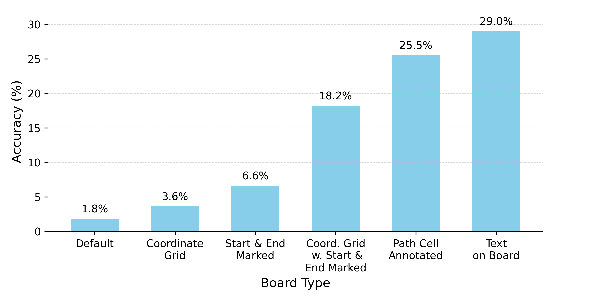
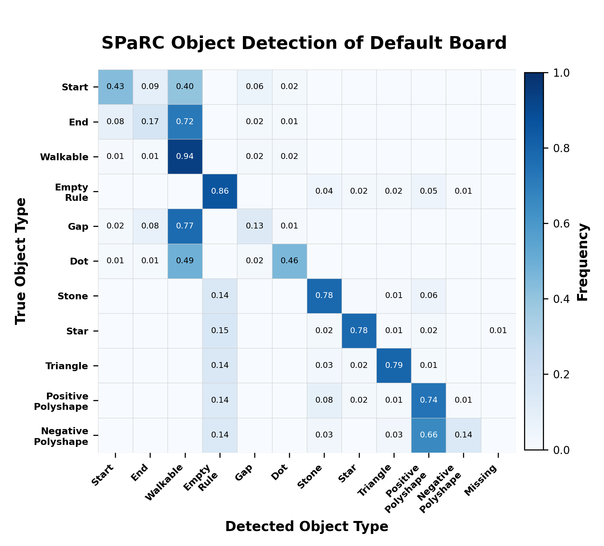
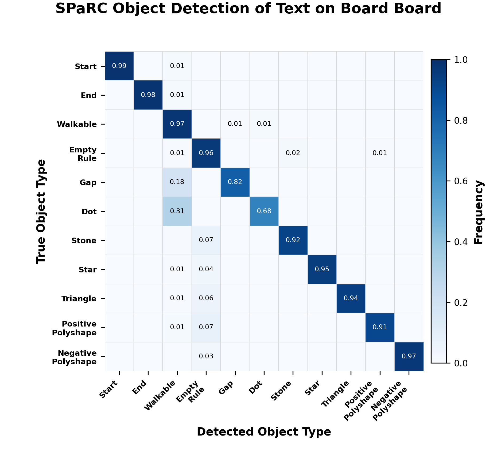
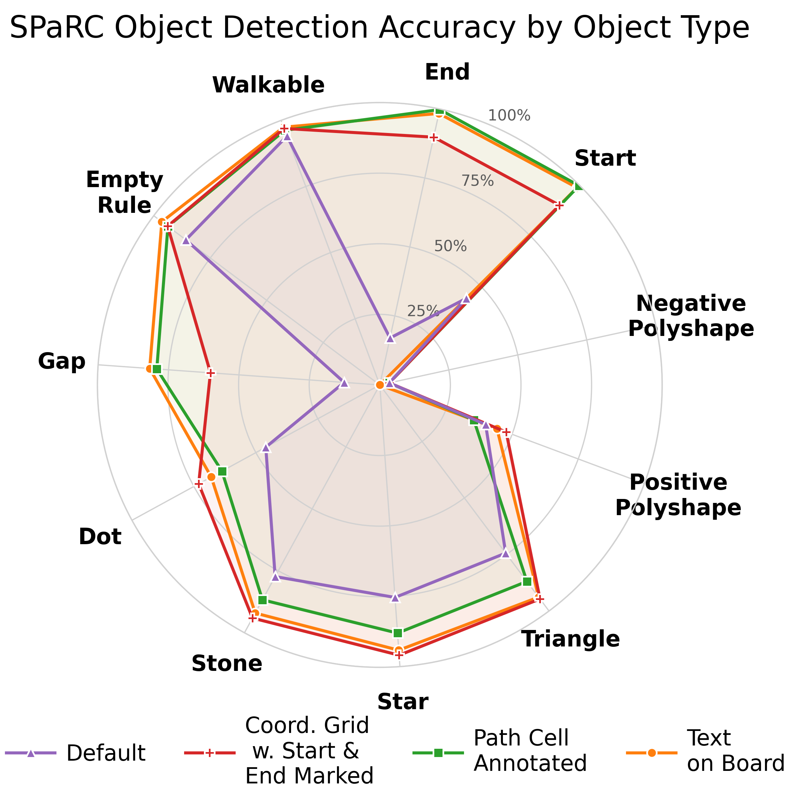
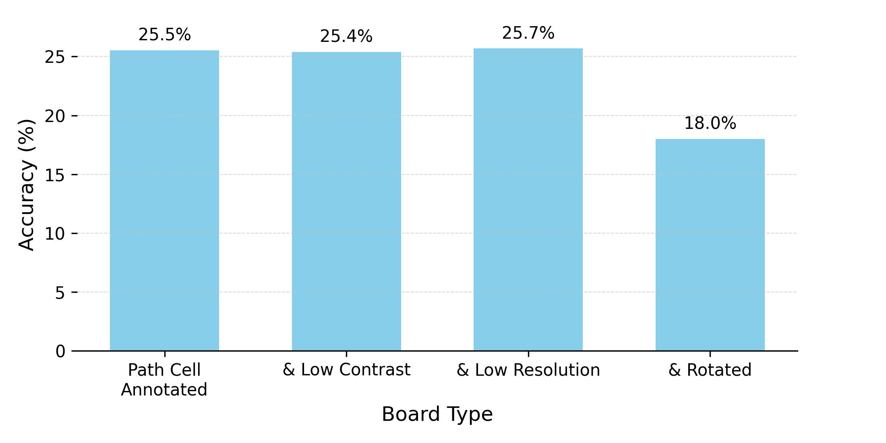

# SPaRC Visual Puzzle Evaluation Repository
This repository contains the evaluation code for the seminar *Selected Topics in Data Science*

## Table of Contents
- [Overview](#overview)
- [Usage](#usage)
- [Prompts](#prompts)
- [Puzzle Representations](#puzzle-representations)
- [Results](#results)
  - [SPaRC Accuracy by Puzzle Representation](#sparc-accuracy-by-puzzle-representation)
  - [What problems does the default board representation have?](#what-problems-does-the-default-board-representation-have)
  - [How well can the best improved puzzle representation detect object types?](#how-well-can-the-best-improved-puzzle-representation-detect-object-types)
  - [Are object specifics (color, number of triangles, shape of polyshapes) detected correctly?](#are-object-specifics-color-number-of-triangles-shape-of-polyshapes-detected-correctly)
  - [What worsens visual representations?](#what-worsens-visual-representations)
- [Acknowledgements](#acknowledgements)

## Overview

This repository evaluates vision-language models on the [SPaRC dataset](https://huggingface.co/datasets/lkaesberg/SPaRC) with various visual puzzle representations and prompt variants. My goal is to determine which visual puzzle representations lead to the best visual reasoning accuracy on the SPaRC benchmark.

Entry points and folders:

- `evaluate.py`: main SPaRC path-solving evaluation (loads dataset, creates board images if needed, sends requests to your model API, validates puzzle paths, and writes results into JSON files).
- `evaluate_object_detection.py`: object-detection ablation evaluation (predict full board object arrays instead of only a final path).
- `prompts/`: prompt templates and routing logic.
- `plots/` and `parallel_image_creation.py`: board rendering code and batch image generation for all puzzle representation variants.
- `evaluation/results/`: raw evaluation outputs (`*_stats_overall.json` and `*_stats_individual.json`) for each model/split/subset/configuration.
- `result_visualizations/`: scripts that visualize results; exported images are saved under `result_visualizations/images/` (and `result_visualizations/object_detection/images/` for object-detection plots).
- `evaluate-model.sbatch`, `evaluate-moa-model.sbatch`, `evaluate-Qwen3-VL-235B-A22B-Thinking-FP8.sbatch`: SLURM examples to start a vLLM server and run evaluation on HPC. Details can vary based on the cluster setup.

## Usage

### Option 1: Run the existing evaluation pipeline in this repository

1. Install dependencies:

```bat
pip install -r requirements.txt
```

2. Start an OpenAI-compatible model API (default expected endpoint: `http://127.0.0.1:8000/v1/chat/completions`).

3. Run the main evaluation by specifying your model, the puzzle representation (`board_type`), and the prompt variant (`prompt_type`) similar to the following example:

```bat
python evaluate.py --model Qwen/Qwen3-VL-235B-A22B-Thinking-FP8 --board-type path_cell_annotated --prompt-type prompt_engineering
```
or for the object-detection ablation evaluation:

```bat
python evaluate_object_detection.py --model Qwen/Qwen3-VL-235B-A22B-Thinking-FP8 --board-type path_cell_annotated
```

Outputs are written to:

- `evaluation/results/<split>/<subset>/<model_name>/` (path-solving evaluation)
- `evaluation/results/object_detection/<split>/<subset>/<model_name>/` (object-detection ablation)

### Option 2: Reuse puzzle representations/prompts in your own project

If you want to implement your own evaluation logic (or just reuse the visual puzzle representations and prompts), use the standalone python library [sparc-visualization](https://github.com/flowun/sparc-visualization) which I published on [PyPI](https://pypi.org/project/sparc-visualization/).

## Prompts

Available `prompt-type` values of main evaluation script:

- `default_tr`: baseline visual prompt with additional textual coordinates of board objects. This is the visual prompt used in the [SPaRC paper](https://arxiv.org/pdf/2505.16686).
- `default_no_tr`: same visual prompt as `default_tr` but without textual coordinates in the text prompt
- `prompt_engineering`: my optimized vision-only prompt (doesn't include coordinates in the text prompt – only in the image)

## Puzzle Representations

Available `board-type` values:

<!--
- `original`: default board rendering.
- `start_end_marked`: start/end nodes are explicitly marked.
- `coordinate_grid`: coordinate grid overlay.
- `coordinate_grid_and_start_end_marked`: grid overlay + explicit start/end markers.
- `path_cell_annotated`: path-cell annotations shown (with coordinates and other labels).
- `text`: puzzle representation with visually rendered text annotations both on the path and the rule cells.
- `low_contrast`: low-contrast board variant.
- `low_contrast_and_path_cell_annotated`: low contrast + path-cell annotation.
- `low_resolution`: downscaled/low-resolution board variant.
- `low_resolution_and_path_cell_annotated`: low resolution + path-cell annotation.
- `rotated`: rotated board variant.
- `rotated_and_path_cell_annotated`: rotated + path-cell annotation.
- `black_frame`: board with black-frame styling.
- `black_frame_and_path_cell_annotated`: black frame + path-cell annotation.
-->

<table width="92%" cellspacing="0" cellpadding="6">
  <tr>
    <th width="33.333%"></th>
    <th width="33.333%"></th>
    <th width="33.333%"></th>
  </tr>

  <tr>
    <td align="center" valign="top">
      <div style="font-family:monospace; overflow-wrap:anywhere;">original</div>
      
    </td>
    <td align="center" valign="top">
      <div style="font-family:monospace; overflow-wrap:anywhere;">start_end_marked</div>
      
    </td>
    <td align="center" valign="top">
      <div style="font-family:monospace; overflow-wrap:anywhere;">coordinate_grid</div>
      
    </td>
  </tr>

  <tr>
    <td align="center" valign="top">
      <div style="font-family:monospace; overflow-wrap:anywhere;">coordinate_grid_and_start_end_marked</div>
      
    </td>
    <td align="center" valign="top">
      <div style="font-family:monospace; overflow-wrap:anywhere;">path_cell_annotated</div>
      
    </td>
    <td align="center" valign="top">
      <div style="font-family:monospace; overflow-wrap:anywhere;">text</div>
      
    </td>
  </tr>

  <tr>
    <td align="center" valign="top">
      <div style="font-family:monospace; overflow-wrap:anywhere;">low_contrast</div>
      
    </td>
    <td align="center" valign="top">
      <div style="font-family:monospace; overflow-wrap:anywhere;">low_contrast_and_path_cell_annotated</div>
      
    </td>
    <td align="center" valign="top">
      <div style="font-family:monospace; overflow-wrap:anywhere;">low_resolution</div>
      
    </td>
  </tr>

  <tr>
    <td align="center" valign="top">
      <div style="font-family:monospace; overflow-wrap:anywhere;">low_resolution_and_path_cell_annotated</div>
      
    </td>
      <td align="center" valign="top">
      <div style="font-family:monospace; overflow-wrap:anywhere;">black_frame</div>
      
    </td>
    <td align="center" valign="top">
      <div style="font-family:monospace; overflow-wrap:anywhere;">black_frame_and_path_cell_annotated</div>
      
    </td>
  </tr>

  <tr>
      <td align="center" valign="top">
      <div style="font-family:monospace; overflow-wrap:anywhere;">rotated</div>
      
    </td>
    <td align="center" valign="top">
      <div style="font-family:monospace; overflow-wrap:anywhere;">rotated_and_path_cell_annotated</div>
      
    </td>
  </tr>
</table>

## Results
The following results all refer to evaluations with the model [Qwen3-VL-235B-A22B-Thinking-FP8](https://huggingface.co/Qwen/Qwen3-VL-235B-A22B-Thinking-FP8) using the improved `prompt_engineering` prompt variant:

### SPaRC Accuracy by Puzzle Representation



→ Improving the visual puzzle representation alone increases the SPaRC accuracy **from 1.8%** (`original`board) **to 25.5%** (`path_cell_annotated`board) **and 29.0%** (`text`on board) → visual representations matter!

→ Annotated Board > Coordinate Grid > Default Board

### What problems does the default board representation have?



→ The model either struggles to detect or struggles to specify the coordinates of the start and endpoint of the path as well as gaps and dots, leading to invalid paths.

→ The model misclassifies object types on rule cells as empty rule cells frequently

→ A small number of misclassifications can make the puzzle unsolvable

### How well can the best improved puzzle representation detect object types?



→ Most object types are consistently detected correctly (only gaps and dots are challenging)

### Are object specifics (color, number of triangles, shape of polyshapes) detected correctly?

The visual SPaRC benchmark does not only require detecting the correct object type, but also the color, the number of objects for triangles, and the specific shape of positive and negative polyshapes. While the previous confusion matrices only show the object type classification, the following object-detection radar chart shows the object-detection accuracy accounting for all object specifics. 



→ Although the `text`on board representation correctly identified positive polyshapes as positive polyshapes and negative polyshapes as negative polyshapes (see confusion matrix), it still struggles to detect the specific shape of the polyshapes which is required to count as being identified correctly in the radar chart.

→ The rest of the accuracies are quite similar to the object-type detection of the confusion matrix, indicating that identifying color and the number of triangles is not a problem.

### What worsens visual representations?



→ Just rotating the board by 15° decreases the accuracy from 25.5% to 18% → When giving an LLM a grid representation, make sure to align the x and y axes of the grid with the x and y axes of the image

→ Lowering the resolution or contrast didn't influence the model's performance noticeably (although bigger reductions might have an effect)

## Acknowledgements
This repository builds on the [SPaRC dataset](https://huggingface.co/datasets/lkaesberg/SPaRC) that was introduced in the paper [SPaRC: A Visual Puzzle Benchmark for Evaluating Spatial Reasoning in Vision-Language Models](https://arxiv.org/pdf/2505.16686) which can be cited as follows:
```bibtex
@inproceedings{kaesberg-etal-2025-sparc,
    title = "{SP}a{RC}: A Spatial Pathfinding Reasoning Challenge",
    author = "Kaesberg, Lars Benedikt and Wahle, Jan Philip and Ruas, Terry and Gipp, Bela",
    booktitle = "Proceedings of the 2025 Conference on Empirical Methods in Natural Language Processing",
    month = nov,
    year = "2025",
    address = "Suzhou, China",
    publisher = "Association for Computational Linguistics",
    url = "https://aclanthology.org/2025.emnlp-main.526/",
    doi = "10.18653/v1/2025.emnlp-main.526",
    pages = "10370--10401"
}
```

Special thanks to Lars Benedikt Kaesberg for supervising me in this project. 
